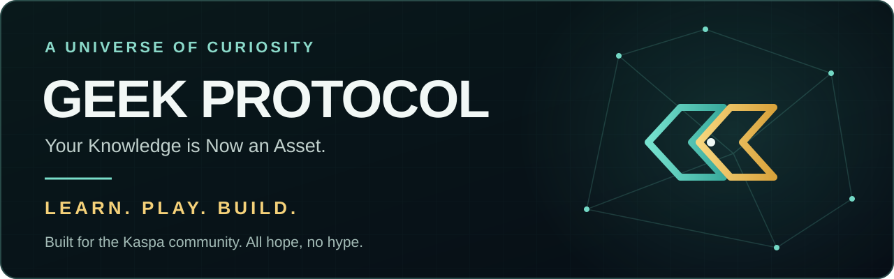

  

  <strong>Your Knowledge is Now an Asset.</strong> 
  A Kaspa-first Proof-of-Learning ecosystem where people build skills, compete, contribute knowledge, and grow a persistent digital identity.

  <a href="https://www.geekprotocol.xyz/">Website</a> ·
  <a href="https://www.geekprotocol.xyz/play">Play Alpha</a> ·
  <a href="https://www.geekprotocol.xyz/collection">GEEK Collection</a> ·
  <a href="https://x.com/geekonkas">X / @geekonkas</a> ·
  <a href="https://t.me/GEEKonKAScommunity">Telegram</a>

  
  
  

## The mission

**GEEK // PROTOCOL** is building a high-powered learning ecosystem on Kaspa.

Players prove what they know through timed challenges, develop a profile that records their journey, collect character-driven digital assets, and help expand the knowledge base through the Community Content Engine.

> **Kaspa meets curiosity. Learning becomes value. Skill beats speculation.**

## Start here

| Repository | Purpose | Lifecycle |
| --- | --- | --- |
| [geek-protocol-hq](https://github.com/GEEKProtocol0110/geek-protocol-hq) | Canonical public Alpha: game experience, player profiles, collection, and Community Content Engine | **Canonical** |
| [geek-protocol-docs](https://github.com/GEEKProtocol0110/geek-protocol-docs) | Protocol documentation, product reference, and litepaper materials | **Reference** |
| [geek-protocol-alpha](https://github.com/GEEKProtocol0110/geek-protocol-alpha) | Engineering monorepo and earlier Alpha implementation | **Reference** |

New here? Visit **[geekprotocol.xyz](https://www.geekprotocol.xyz/)** or begin with **[geek-protocol-hq](https://github.com/GEEKProtocol0110/geek-protocol-hq)**.

## What we are building

- **Proof of Learning** — timed, category-based challenges designed to reward demonstrated knowledge.
- **Player identity** — profiles that preserve level, prestige, achievements, avatars, and each player's learning journey.
- **Community Content Engine** — a reviewable pipeline for submitting, validating, and rewarding high-quality questions.
- **GEEK collection** — 600 character-driven avatars, stickers, trading, and lore led by GIGA and A.C.E.
- **Kaspa-native value** — transparent, low-friction activity built around user-controlled Kaspa wallets.
- **Social play** — public and private lobbies, head-to-head challenges, tournaments, and community events.

## Ecosystem map

| Project | Focus | Lifecycle |
| --- | --- | --- |
| [geek-mini](https://github.com/GEEKProtocol0110/geek-mini) | Compact game-mode experiments | Prototype |
| [geek-wallet](https://github.com/GEEKProtocol0110/geek-wallet) | Non-custodial Kaspa wallet UX exploration | Prototype |
| [geek-jr-indexcards](https://github.com/GEEKProtocol0110/geek-jr-indexcards) | Early-learning and index-card experience | Prototype |
| [level-up-life](https://github.com/GEEKProtocol0110/level-up-life) | Family learning and progression concepts | Prototype |
| [kaspa-live-widget](https://github.com/GEEKProtocol0110/kaspa-live-widget) | Kaspa live-data widget | Prototype |
| [kaspa-speed-benchmark-dashboard](https://github.com/GEEKProtocol0110/kaspa-speed-benchmark-dashboard) | Kaspa performance visualization | Prototype |
| [a.c.e.-AGI](https://github.com/GEEKProtocol0110/a.c.e.-AGI) | A.C.E. research direction | Incubating |
| [geek-protocol-site](https://github.com/GEEKProtocol0110/geek-protocol-site) | Previous website implementation | Superseded |
| [geek--jr](https://github.com/GEEKProtocol0110/geek--jr) | Earlier GEEK Jr concept | Superseded |

**Lifecycle key:** Canonical = active source of truth · Reference = supporting implementation or documentation · Prototype = exploratory build · Incubating = direction under development · Superseded = retained for history.

## The world behind the protocol

- **GIGA** — the golden heart of the community.
- **A.C.E.** — the Automated Cerebral Emulator and challenge host.
- **The Omniscient Grid** — the knowledge network connecting competition, creation, and discovery.
- **The Cognoscenti** — players who prove their knowledge and help the ecosystem grow.

## Trust, security, and audit readiness

GEEK Protocol is in public Alpha and is **not yet independently audited**. Public interfaces may demonstrate wallet, reward, collection, and minting flows, but production settlement, treasury payouts, and irreversible mint execution must remain gated until their deployment identifiers, terms, wallet controls, monitoring, and external security review are publicly verifiable.

- [Security policy](https://github.com/GEEKProtocol0110/geek-protocol-hq/blob/main/SECURITY.md)
- [Audit-readiness scope](https://github.com/GEEKProtocol0110/geek-protocol-hq/blob/main/docs/security/AUDIT_READINESS.md)
- [Current project status](https://github.com/GEEKProtocol0110/geek-protocol-hq/blob/main/docs/PROJECT_STATUS.md)

Never send funds, reveal a seed phrase, or sign an unexpected transaction because of a message claiming to represent GEEK Protocol.

## Build with us

We welcome careful contributors across game design, education, Kaspa engineering, accessibility, security, art, and world-building.

1. Read the [HQ contributing guide](https://github.com/GEEKProtocol0110/geek-protocol-hq/blob/main/CONTRIBUTING.md).
2. Review the [open HQ issues](https://github.com/GEEKProtocol0110/geek-protocol-hq/issues).
3. Open a focused pull request with tests or evidence where appropriate.
4. Report vulnerabilities privately through the process in [SECURITY.md](https://github.com/GEEKProtocol0110/geek-protocol-hq/blob/main/SECURITY.md).

---

  <strong>GEEK // PROTOCOL</strong> 
  Build knowledge. Prove skill. Level up. 
  <em>All Hope. No Hype.</em>

